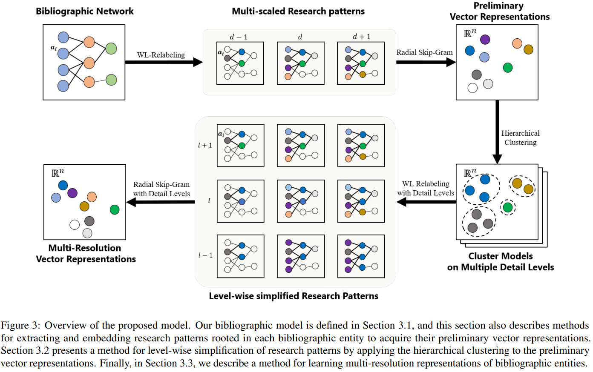

# Multi-resolution Network Embedding

### Abstract
<p align="justify">This study aims at representing research patterns of bibliographic entities (e.g., scholars, papers, and venues) with a fixed-length vector. Bibliographic network structures rooted in the entities are incredibly diverse, and this diversity increases in the outstanding entities. Thus, despite their significant volume, the outstanding entities obtain minimal learning opportunities, whereas low-performance entities are over-represented. This study solves the problem by representing the patterns of the entities rather than depicting individual entities in a precise manner. First, we describe structures rooted in the entities using the Weisfeiler-Lehman (WL) relabeling process. Each subgraph generated by the relabeling process provides information on the scholars, kinds of papers they published, standards of venues in which the papers were published, and types of their collaborators. We assume that a subgraph depicts the research patterns of bibliographic entities, such as the preference of a scholar in choosing either a few highly impactful papers or numerous papers of moderate impact. Then, we simplify the subgraphs according to multiple levels of detailedness. Original subgraphs represent the individuality of the entities, and simplified subgraphs represent the entities sharing the same research patterns. In addition, simplified subgraphs balance the learning opportunities of high- and low-performance entities by co-occurring with both types of entities. We embed the subgraphs using the Skip-Gram method. If the results of the embedding represent the research patterns of the entities, the obtained vectors should be able to represent various aspects of the research performance in both the short-term and long-term durations regardless of the performances of the entities. Therefore, we conducted experiments for predicting 23 performance indicators during four time periods for four performance groups (top 1\%, 5\%, 10\%, and all entities) using only the vector representations. The proposed model outperformed the existing network embedding methods in terms of both accuracy and variance. 
</p>
<p align="center">
  
</p>

This repository provides an implementation for learning representation of level-wise simplified research patterns as it is described in:
> Hyeon-Ju Jeon, O-Joun Lee, Jason J. Jung:
> Learning Multi-Resolution Representations of Research Patterns in Bibliographic Networks
>  Journal of Informetrics 15 (1) (2021) 101126. DOI:10.1016/j.joi.2020.101126
 [[Full-text]](https://www.sciencedirect.com/science/article/pii/S175115772030643X).

### Requirements

The codebase is implemented in Python 3.6.1 | Anaconda 4.6.14 (64-bit). Package versions used for development are just below.
```
jsonschema        2.6.0
numpy             1.15.4
pandas            0.23.4
texttable         1.5.0
gensim            3.8.0
seaborn           0.9.0
matplotlib        2.2.3
```
The original subgraph2vec implementation is available [[here]](https://github.com/MLDroid/subgraph2vec_gensim).
This is developed on top of "gensim" python package.


### Datasets
We composed the bibliographic network by refining the [ArnetMiner dataset](https://www.aminer.cn/citation) (Sinha et al., 2015), which has been widely used as a benchmark dataset to evaluate network embedding models. This dataset consists of bibliographic data collected from [DBLP](https://dblp.uni-trier.de), the [ACM Digital Library](https://dl.acm.org/), [Microsoft Academic Graph](https://www.microsoft.com/en-us/research/project/microsoft-academic-graph/), and other sources. Sinha et al. (2015) have been distributing collected data online after a preprocessing process, including a disambiguation of the bibliographic entities’ identities. However, for scholars and venues, not all of their papers were collected in a consistent fashion. Thus, from the latest version of the ArnetMiner dataset (DBLPCitation-network V11), we obtained papers published from 2011 to 2018 and removed the venues and scholars with incomplete bibliography data. The original version consists of 4, 107, 340 papers and 36, 624, 464 citation relationships. In addition, our refined version includes 351, 914 papers published by 396, 857 scholars in 141 venues. Since not all the pre-existing embedding models are for heterogeneous networks, we also composed a co-authorship and citation network of papers and venues with the same dataset.


### Options

Representation learning procedures are handled by `02_source code/embedding.py` script that provides the following command line arguments.


## Contact ##
In case of queries, please email: higd963@gmail.com


